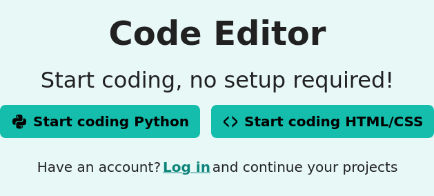
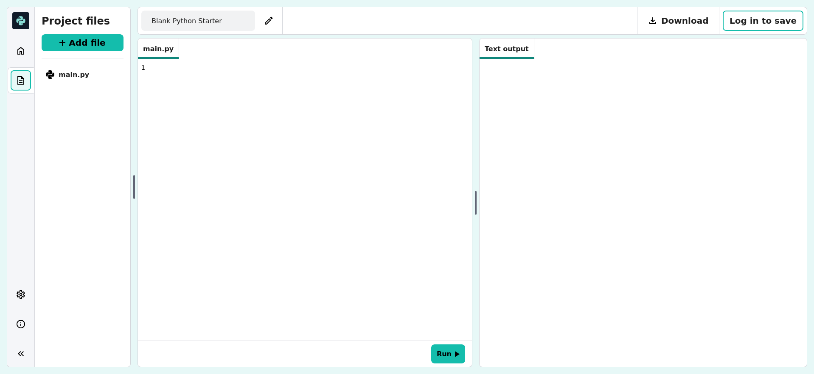
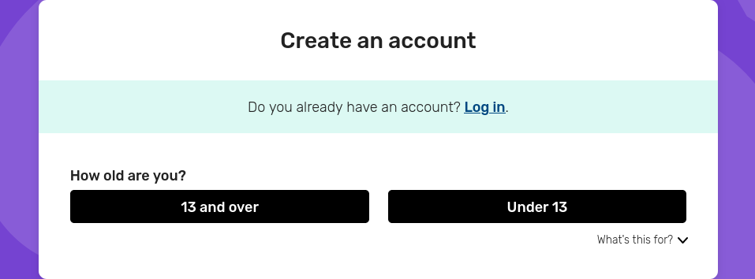

## Moving to the Code Editor

The Raspberry Pi Foundation’s Code Editor is an online coding tool that is designed to help young people learn text-based programming. Whether they want to learn Python or build amazing websites with HTML, CSS, and JavaScript, our bespoke tool provides everything learners need.

### What makes the Code Editor special?
- It's free, forever! Learners can start coding right away without any costs.
- Learners can use the Editor to write and run code in a web browser, without needing to install any additional software. 
- Learners can jump right in, with no setup required. They can create a new Python or a web project, or explore projects and starter templates in our Python and web design paths for inspiration.
- The Editor is designed for learning: learners can enjoy a friendly environment that helps them understand their code.
- The Editor has helpful tools, such as syntax highlighting autocomplete, and error checking.

### Getting started
1. Learners can visit the Code Editor website.

  

2. If learners would like to save their work, they can set up a Raspberry Pi account (if learners are under 13, they will need to use a parent or guardian's email address to do this). Please note that learners do not need an account to use the Code Editor; just to save their work.

  

3. Learners can pick a project type: they can dive into Python or create awesome websites.

  

4. Learners can use the file storage pane to select different files, get creative with code in the code writing area, and see the results of their work in the output area.

### Important notes
- Learners can copy and paste existing code into the Editor, to transfer code from other online or local development tools.
- Learners can download their projects to run them on their own computer.
- Learners cannot currently upload their own files to the Editor.
